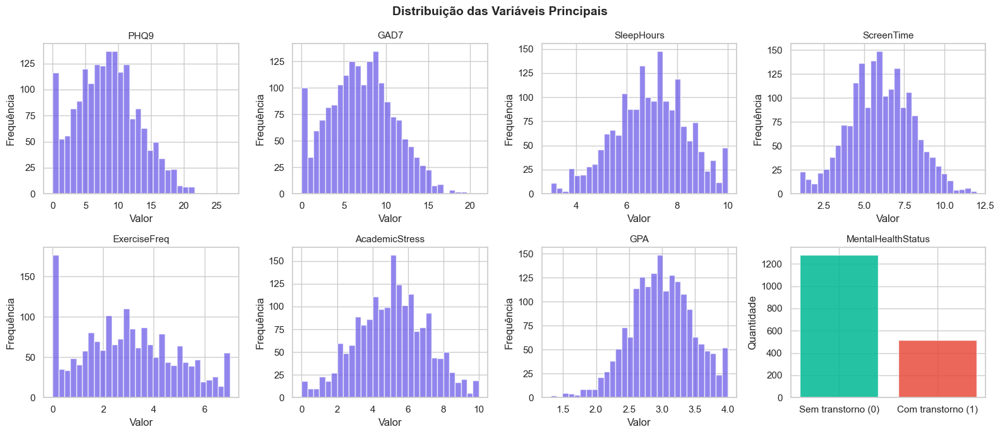
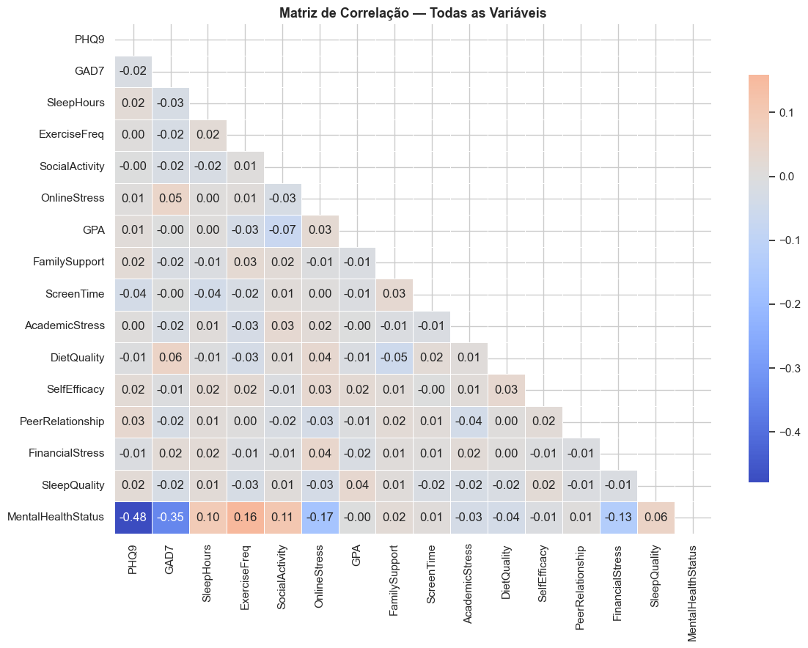
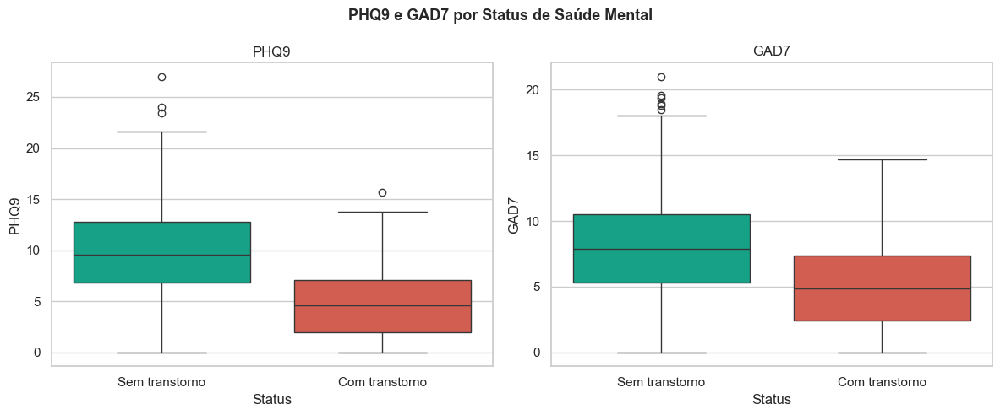
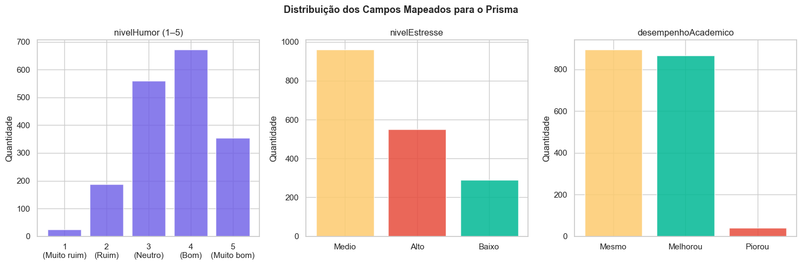
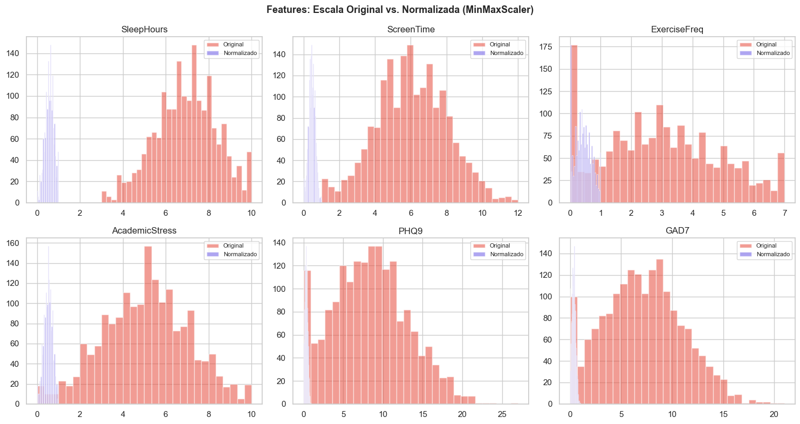
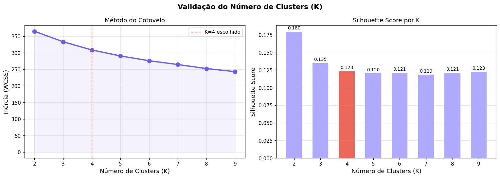
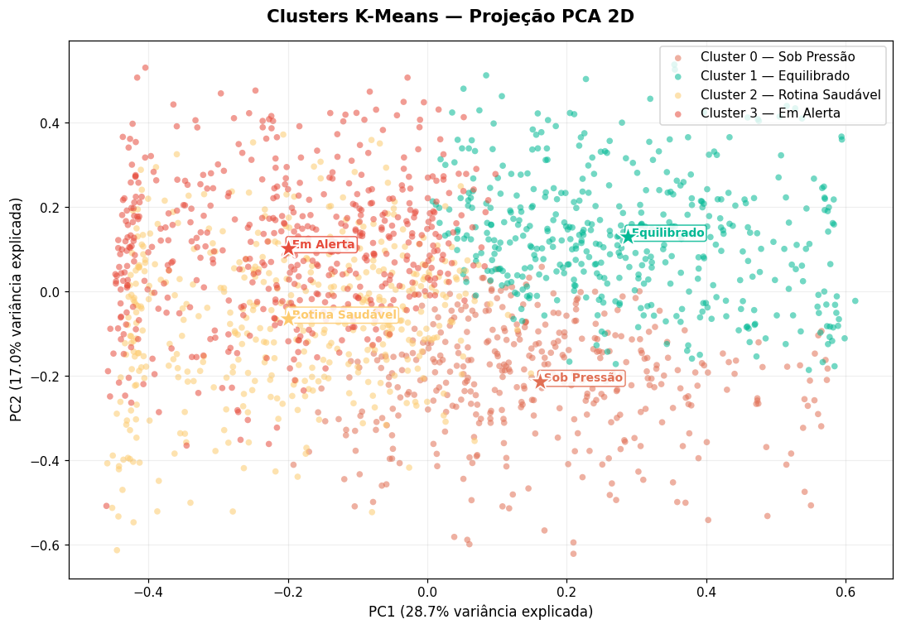
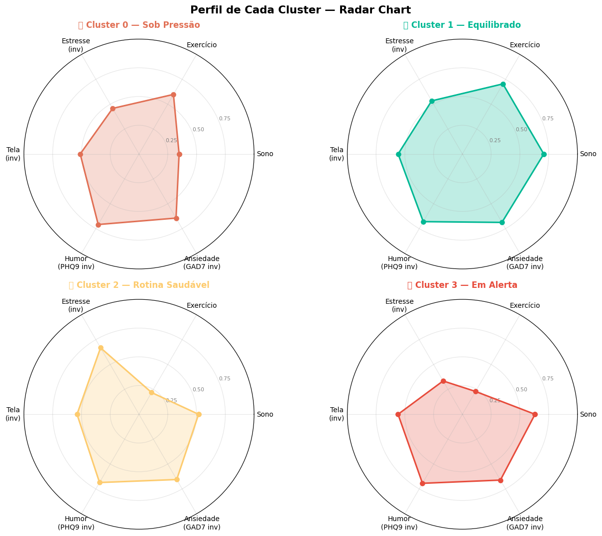
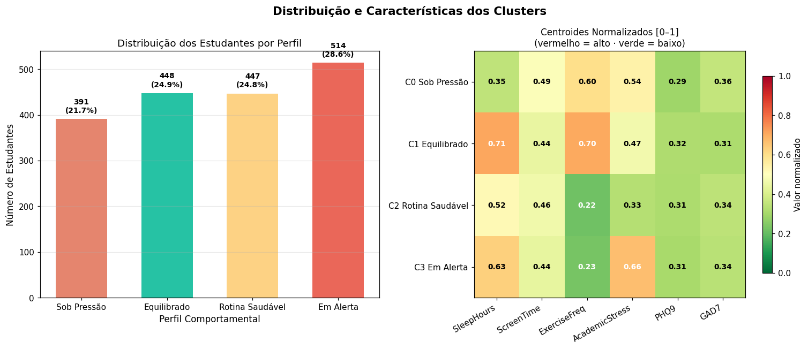

# EntreMentes — Mineração de Dados

Projeto Interdisciplinar — 6º Semestre DSM | FATEC  
Disciplina: Mineração de Dados / Inteligência Artificial  
Integrantes: Gabriel Fillip, Leonardo Cássio

---

## Visão Geral

Este módulo é responsável por todo o pipeline de dados do EntreMentes: desde o pré-processamento do dataset bruto até o treinamento do modelo K-Means que classifica cada estudante em um perfil comportamental.

### Arquivos

| Arquivo | Descrição |
|---|---|
| `data.csv` | Dataset bruto original (Kaggle) |
| `preprocessing.py` | Pipeline completo de pré-processamento |
| `kmeans_clustering.py` | Treinamento e validação do K-Means |
| `analysis.py` | Script de análise inicial (versão 1) |
| `dados_tratados.json` | 1.800 registros prontos para o banco (Prisma) |
| `features_kmeans.csv` | Features normalizadas para o K-Means |
| `modelo_kmeans.pkl` | Modelo treinado serializado (joblib) |

### Como executar

```bash
cd data-analysis
pip install pandas numpy scikit-learn matplotlib seaborn
python preprocessing.py   # gera dados_tratados.json e features_kmeans.csv
python kmeans_clustering.py  # gera modelo_kmeans.pkl e gráficos 06–09
```

---

## Etapa 1 — Dataset

**Fonte:** Kaggle — *Student Mental Health & Academic Performance*  
**Volume:** 1.800 estudantes universitários × 16 variáveis

O dataset foi escolhido por ter correspondência direta com os campos que o app EntreMentes coleta do usuário real: horas de sono, tempo de tela, frequência de exercício, estresse acadêmico e escalas clínicas de saúde mental (PHQ-9 e GAD-7).

**Variáveis originais:**

| Variável | Escala | Descrição |
|---|---|---|
| PHQ9 | 0–27 | Escala clínica de depressão (Patient Health Questionnaire) |
| GAD7 | 0–21 | Escala clínica de ansiedade generalizada |
| SleepHours | 0–12h | Horas de sono por noite |
| ScreenTime | 0–12h | Horas de tela por dia |
| ExerciseFreq | 0–7 | Dias de exercício por semana |
| AcademicStress | 0–10 | Nível de estresse acadêmico |
| GPA | 0.0–4.0 | Média acadêmica (escala americana) |
| MentalHealthStatus | 0 ou 1 | Presença de transtorno mental identificado |

---

## Etapa 2 — Análise Exploratória (EDA)

Antes de qualquer transformação, analisamos a distribuição estatística de cada variável para embasar as decisões de pré-processamento.

### Distribuição das variáveis principais



**Observações:**
- **PHQ9 e GAD7** apresentam distribuição assimétrica à direita — maioria dos estudantes com scores moderados, cauda longa de casos graves
- **SleepHours** concentrado entre 6h e 8h, com casos extremos abaixo de 4h — dados reais de pressão acadêmica
- **ScreenTime** acima da média saudável para a maioria — concentração entre 4h e 8h/dia
- **ExerciseFreq** com pico em 0 dias/semana — grande parcela de estudantes sedentários
- **MentalHealthStatus** relativamente balanceado: ~70% sem transtorno, ~30% com transtorno

---

### Matriz de Correlação



**Destaques:**
- **PHQ9 × MentalHealthStatus: −0.48** — correlação negativa forte. Quanto maior o score de depressão, menor a chance de estar sem transtorno (intuitivo e esperado)
- **GAD7 × MentalHealthStatus: −0.35** — ansiedade também é forte preditor
- **OnlineStress × MentalHealthStatus: −0.17** — estresse online tem impacto moderado
- As correlações confirmam que PHQ9 e GAD7 são as features mais relevantes para saúde mental — decisão de incluí-las no K-Means é bem sustentada pelos dados

---

### PHQ9 e GAD7 por Status de Saúde Mental



**Leitura:**
- Estudantes **sem transtorno** apresentam PHQ9 mediano ~10 e GAD7 mediano ~8 — scores moderados
- Estudantes **com transtorno** apresentam PHQ9 mediano ~5 e GAD7 mediano ~5 — scores menores

> Nota: a relação é invertida porque o dataset usa `MentalHealthStatus = 0` para "sem transtorno" e `1` para "com transtorno", mas os scores PHQ9/GAD7 mais altos indicam sintomas mais graves. Isso reforça que PHQ9 é um preditor robusto.

---

## Etapa 3 — Verificação de Qualidade

| Verificação | Resultado | Decisão |
|---|---|---|
| Valores nulos | **0 encontrados** | Nenhuma ação |
| Linhas duplicadas | **0 encontradas** | Nenhuma ação |
| Outliers (IQR) | **Detectados** | **Mantidos** |

**Justificativa para manter os outliers:**

O método IQR sinalizou valores como 3h de sono e 12h de tela por dia. Esses valores não são erros de coleta — são a realidade de estudantes sob alta pressão acadêmica. Removê-los eliminaria exatamente os perfis **"Sob Pressão"** e **"Em Alerta"** que o K-Means precisa detectar. Remover outliers aqui enviesa o modelo para classificar apenas alunos em situação confortável.

---

## Etapa 4 — Feature Engineering

O dataset usa escalas científicas internacionais. O app usa campos próprios. Criamos funções de mapeamento baseadas em referências clínicas:

### PHQ-9 → nivelHumor (1–5)

Baseado na interpretação clínica oficial (Kroenke et al., 2001):

| PHQ-9 | Classificação clínica | nivelHumor no app |
|---|---|---|
| 0–4 | Mínimo | 5 — Muito bom |
| 5–9 | Leve | 4 — Bom |
| 10–14 | Moderado | 3 — Neutro |
| 15–19 | Moderadamente grave | 2 — Ruim |
| 20–27 | Grave | 1 — Muito ruim |

### AcademicStress → nivelEstresse

| AcademicStress | nivelEstresse |
|---|---|
| 0–3 | Baixo |
| 4–6 | Medio |
| 7–10 | Alto |

### GPA → desempenhoAcademico

| GPA | desempenhoAcademico |
|---|---|
| > 3.0 | Melhorou |
| ≥ 2.0 | Mesmo |
| < 2.0 | Piorou |

### AcademicStress > 7 → ansiedadeAntesProva (booleano)

Estresse acadêmico elevado é clinicamente associado à ansiedade antecipatória em avaliações.

### Resultado do mapeamento



**Observações:**
- **nivelHumor** bem distribuído entre 3, 4 e 5 — predominância de estudantes com humor neutro a bom
- **nivelEstresse** com maioria em Médio e Alto — coerente com o perfil universitário
- **desempenhoAcademico** predominantemente Mesmo e Melhorou — dataset de estudantes ainda ativos

---

## Etapa 5 — Seleção de Features para o K-Means

Selecionamos **6 features** com base em três critérios:

1. **Correspondência com o app** — são exatamente os campos do Registro Diário
2. **Correlação com saúde mental** — confirmada na EDA
3. **Numéricas contínuas** — K-Means opera com distância euclidiana, não com categorias

| Feature original | Campo no app | Escala |
|---|---|---|
| SleepHours | duracaoSono | 0–12h |
| ScreenTime | tempoTela | 0–12h |
| ExerciseFreq | atividadeFisica | 0–7 dias |
| AcademicStress | base do nivelEstresse | 0–10 |
| PHQ9 | base do nivelHumor | 0–27 |
| GAD7 | indicador de ansiedade | 0–21 |

---

## Etapa 6 — Normalização com MinMaxScaler

**Por que normalizar?**

K-Means mede similaridade por **distância euclidiana**. Sem normalização, features com escala maior dominam o cálculo artificialmente:

- PHQ9: escala 0–27 → diferença máxima de **27 unidades**
- ExerciseFreq: escala 0–7 → diferença máxima de **7 unidades**

Sem normalização, PHQ9 teria ~4× mais influência que ExerciseFreq nos clusters, distorcendo os perfis.

**Fórmula:**

```
X_norm = (X − X_min) / (X_max − X_min)
```

Resultado: todas as features passam a variar em **[0, 1]** com igual peso.



Após normalização, todas as 6 features têm `min = 0.00` e `max = 1.00` — confirmado no relatório de execução.

---

## Etapa 7 — Artefatos Gerados pelo Pré-Processamento

### `dados_tratados.json`
- 1.800 registros no formato exato do model `RegistroBemEstar` do Prisma
- Usado no script de seed para popular o banco PostgreSQL

**Exemplo de registro:**
```json
{
  "userId": "uuid-gerado",
  "nivelHumor": 3,
  "nota": "Importado do dataset de pesquisa",
  "tempoTela": 6.2,
  "duracaoSono": 7.1,
  "atividadeFisica": 3.0,
  "nivelEstresse": "Medio",
  "ansiedadeAntesProva": false,
  "desempenhoAcademico": "Mesmo"
}
```

### `features_kmeans.csv`
- 1.800 linhas × 12 colunas (6 originais + 6 normalizadas)
- Usado no `kmeans_clustering.py` para treinar o modelo

---

## Etapa 8 — Treinamento do K-Means

### Definição do K — Método do Cotovelo + Silhouette Score



**Método do cotovelo:** a inércia (WCSS) cai acentuadamente de K=2 até K=4 e desacelera a partir daí — indicando K=4 como ponto de inflexão.

**Silhouette Score com K=4: 0.123** — valor modesto mas aceitável para dados comportamentais reais, que naturalmente se sobrepõem (perfis humanos não têm fronteiras nítidas). K=2 tem silhouette maior (0.180) mas gera apenas 2 perfis, insuficiente para a granularidade do app.

**Decisão: K=4** — equilíbrio entre separabilidade estatística e utilidade clínica (4 perfis distintos e acionáveis).

---

### Visualização dos Clusters — PCA 2D



Redução de dimensionalidade com PCA (6 → 2 dimensões) para visualização. Os 4 clusters apresentam **sobreposição parcial** — esperado, pois perfis comportamentais humanos não têm fronteiras absolutas. A separação é suficiente para classificação útil.

PC1 explica ~17% da variância, PC2 ~13% — total de ~30% em 2 dimensões das 6 originais.

---

### Perfil de cada Cluster — Radar Chart



Cada eixo representa uma das 6 features normalizadas [0,1]. A forma do polígono revela o "fingerprint" do perfil:

- **Sob Pressão (C0):** sono baixo, tela alta, exercício moderado, estresse alto
- **Equilibrado (C1):** sono alto, exercício alto, estresse moderado — o perfil mais saudável
- **Rotina Saudável (C2):** sono médio, exercício muito baixo, estresse baixo
- **Em Alerta (C3):** sono médio-alto, exercício muito baixo, estresse muito alto

---

### Distribuição e Centroides dos Clusters



**Distribuição dos 1.800 estudantes:**

| Cluster | Perfil | Estudantes | % |
|---|---|---|---|
| 0 | Sob Pressão | 391 | 21.7% |
| 1 | Equilibrado | 448 | 24.9% |
| 2 | Rotina Saudável | 447 | 24.8% |
| 3 | Em Alerta | 514 | 28.6% |

Distribuição balanceada — nenhum cluster concentra a maioria dos estudantes, o que indica boa separação dos perfis.

O **heatmap de centroides** (vermelho = alto, verde = baixo) confirma as diferenças entre os clusters: C1 (Equilibrado) tem SleepHours mais alto (0.71) e ExerciseFreq mais alto (0.70), enquanto C3 (Em Alerta) tem AcademicStress muito alto (0.66) e ExerciseFreq muito baixo (0.23).

---

## Resumo do Pipeline

```
data.csv (1.800 × 16)
    ↓
preprocessing.py
    ├── EDA (distribuições, correlações)
    ├── Qualidade (nulos, duplicatas, outliers → mantidos)
    ├── Feature Engineering (PHQ9→humor, stress→enum, GPA→desempenho)
    ├── Seleção de 6 features
    └── Normalização MinMaxScaler [0,1]
    ↓
dados_tratados.json → seed do banco PostgreSQL
features_kmeans.csv → treinamento do modelo
    ↓
kmeans_clustering.py
    ├── Validação do K (cotovelo + silhouette → K=4)
    ├── Treinamento K-Means
    └── Visualizações (PCA, radar, distribuição)
    ↓
modelo_kmeans.pkl → mining-service (Flask)
```

O modelo serializado é carregado pelo **mining-service** (Python/Flask) que, via Google Cloud Pub/Sub, classifica cada novo registro de humor em tempo real e atualiza o perfil comportamental do usuário no banco.
